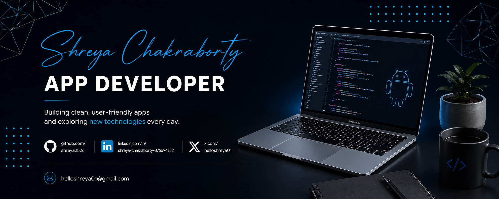

<h1 align="center">Hey 👋, I'm Shreya Chakraborty</h1>

  

  

---

## 👨‍💻 About Me

* 📱 Currently focused on **Android development**
* 🧩 Interested in **Android, iOS, and cross-platform app development**
* 🌱 Continuously learning **modern application development practices**
* 🎨 Interested in building **clean and user-friendly interfaces**
* 💬 Ask me about **Android, iOS, Cross Platform, and App Development**
* 🚀 Always exploring new technologies and improving my development skills

---

## 🚧 Currently Working On

📱 **Android & Cross-Platform Development**

Currently learning and building applications while exploring modern mobile development technologies, frameworks, and development practices.

**🔨 Always learning. Always building.**

---

## 💻 Building Under Contraris

**Contraris** is our developer identity for publishing and experimenting with Android products on Google Play.

I use it to turn ideas into real products, learn through hands-on development, and continuously improve through user feedback.

📱 **[View Contraris on Google Play](https://play.google.com/store/apps/developer?id=Contraris)**

---

## 🚀 Featured Project

### 🎵 LocalWave — Local Music Player

A modern offline Android music player built for a clean, responsive, and distraction-free listening experience, with persistent playback and dynamic album-based theming.

---

## 📚 Currently Learning

* 📱 Android Development
* ⚡ Cross-platform frameworks — Flutter & React Native
* 🌐 Modern App Development Practices
* 🎨 UI/UX improvements
* 🧠 Exploring new technologies and development approaches

---

## 🧩 Core Skills

* 📱 **Mobile Development:** Android, iOS
* 🌐 **Web:** HTML, CSS, JavaScript
* 🧠 **Programming:** C, Java, Python, Kotlin
* 🔥 **Backend & Database:** Firebase, MySQL, Oracle
* 🎨 **UI/UX:** Figma
* ⚙️ **Tools & Frameworks:** Git, Bootstrap

---

## 🧠 Technologies & Tools

  

---

## 📊 GitHub Analytics

  

  

---

## 🐍 Contribution Snake

  

---

## 🎯 Current Focus

* 🚀 Improving Android development skills
* 📱 Building cross-platform applications
* 🧠 Learning modern tools and frameworks
* 🎨 Creating better and more user-friendly app experiences
* 🌱 Continuously expanding software development knowledge

---

## 💡 Developer Mindset

* 🛠️ Build practical and useful applications
* 🧹 Keep code clean and maintainable
* 🧠 Learn by building and experimenting
* 🚀 Continuously improve development skills
* 🌱 Stay curious and keep learning

---

## ⭐ What I Enjoy

🚀 Exploring **App Development & Cross-Platform Solutions**

💡 Building **efficient and user-friendly applications**

🧠 Learning **new technologies, tools, and development practices**

---

## 🔗 Let's Connect

  
  &nbsp;&nbsp;
  
  &nbsp;&nbsp;
  

  <b>📧 Reach me at</b> 
  <a href="mailto:helloshreya01@gmail.com">helloshreya01@gmail.com</a>

---

  <i>Keep learning, keep building, and keep exploring. 🚀</i>

  

