<h1 align="center">Hi 👋, I'm Shreya Chakraborty</h1>

  

  

---

## 👨‍💻 About Me

- 🌱 Currently learning **Android**
- 👨‍💻 Projects:  
  - https://github.com/shreya2526 
- 💬 Ask me about **Android, iOS, Cross Platform, App Development**
- 📫 Reach me: **helloshreya01@gmail.com**

---

## 📚 Currently Learning

- 📱 Android Development  
- ⚡ Cross-platform frameworks (Flutter, React Native)  
- 🌐 Modern App Development Practices  
- 🎨 UI/UX improvements  

---

## 🧩 Core Skills

- 📱 Mobile Development: Android, iOS  
- 🌐 Web: HTML, CSS, JavaScript  
- 🧠 Programming: C, Java, Python, Kotlin  
- 🔥 Backend & DB: Firebase, MySQL, Oracle  
- 🎨 UI/UX: Figma  
- ⚙️ Tools: Git, Bootstrap  

---

## 🌐 Connect With Me

  
  

---

## 🧠 Tech Stack

  

---

## 📊 GitHub Analytics

  

  

---

## 🐍 Contribution Snake

  

---

## 🎯 Current Focus

- 🚀 Improving Android development skills  
- 📱 Building cross-platform applications  
- 🧠 Learning modern tools & frameworks  

---

## 🧠 Developer Mindset

- Build practical and useful applications  
- Keep code clean and maintainable  
- Always keep learning 🚀  

---

## ⭐ Highlight

🚀 Passionate about **App Development & Cross-Platform Solutions**  
💡 Focused on building **efficient and user-friendly applications**

---

## ⚡ Final Note

I’m passionate about building apps that are **functional, user-friendly, and impactful**.

Always open to:
- 💼 Collaborations  
- 🚀 New projects  
- 💡 Ideas  
- 🧠 Learning opportunities  

---

  

